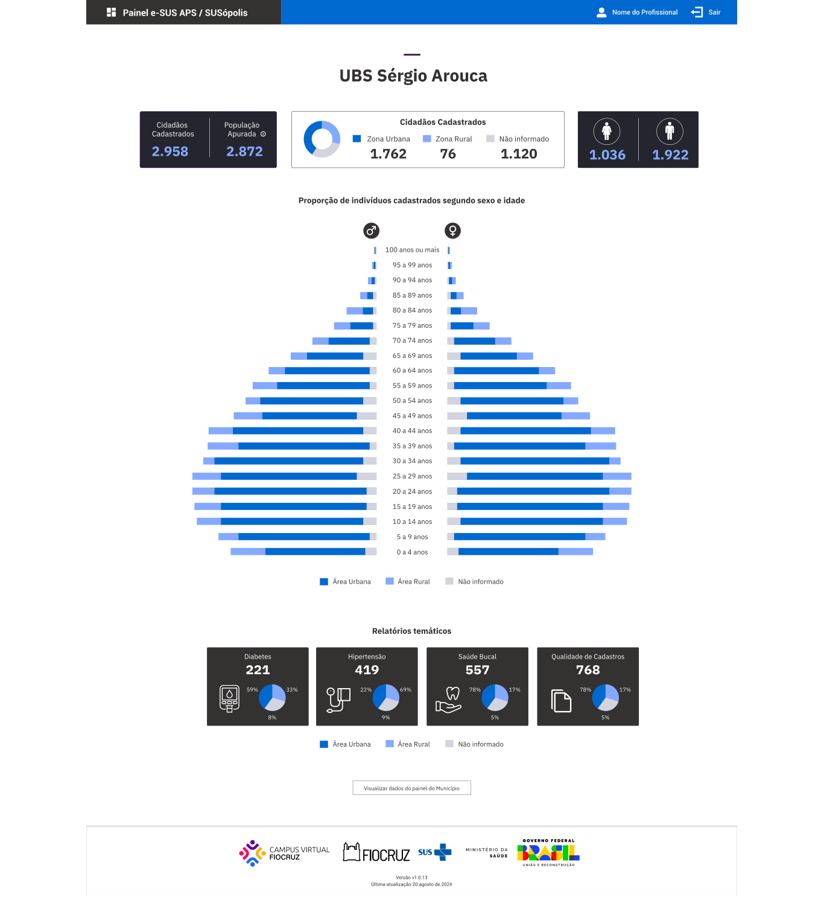

# Relatório Sociodemográfico

O Relatório Sociodemográfico apresenta as informações populacionais.

## Protótipo XD

## Regra Geral

Release a version 1.0 of your project:

## Tabelas 
tb_acomp_cidadaos_vinculados

tb_fat_atendimento_individual

tb_fat_familia_terriotrio

tb_fat_cidadao_pec

tb_fat_cad_domiciliar

tb_dim_tempo

tb_dim_cbo

## Variáveis
co_seq_fat_atd_ind
co_dim_tempo
nu_cns
nu_peso
nu_altura
co_dim_unidade_saude
co_dim_faixa_etaria
co_dim_sexo
co_dim_local_atendimento
co_fat_cidadao_pec
nu_cpf_cidadao
codigo
tipo
co_dim_cbo_1
no_cidadao
co_dim_tipo_localizacao
co_dim_tempo_nascimento
cbo
dt_registro