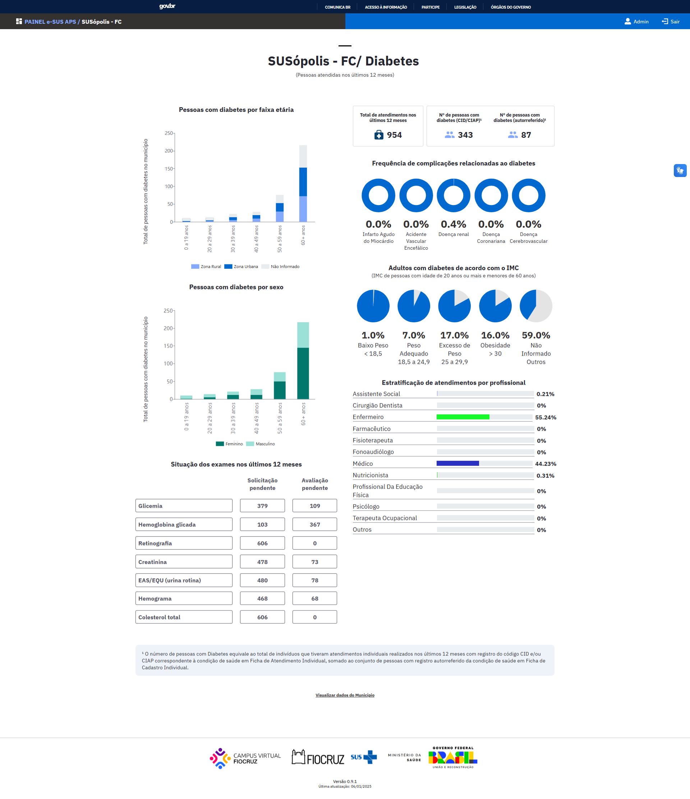

# Relatório Temático Hipertensão

Este relatório tem como objetivo:

- favorecer aumento da cobertura de identificação, manejo, acompanhamento transdisciplinar e promoção da saúde de pessoas com diabetes na Atenção Primária à Saúde
- monitorar e prevenir agravos, principalmente aqueles relacionados a internações por condições sensíveis à atenção primária (ICSAP)
- contribuir com ferramentas para ações de acompanhamento e monitoramento de pessoas com diabetes

## Tela v.0.9.1 (beta)

## Regras

1. IIdentificação das pessoas a partir da Ficha de atendimento individual: código CID10 e CIAP 2 E/OU problema/condição avaliada
E/OU
Identificação das pessoas a partir da Ficha de cadastro individual: questionário autorreferido de condições/ situações de saúde
#20 statusTemHipertensaoArterial
Código AB: ABP005
CIAP2: K86; K87; W81
CID10: I10, I11, I110, I119, I12, I120, I129, I13, I130, I131, I132, I139,I15, I150, I151, I152, I158, I159, I270, I272, O10, O100, O101, O102, O103, O104 e O109
    
2. Estratificar por idade e sexo
3. Identificação de exames solicitados E avaliados nos últimos 12 meses:
    1. Aferição de PA código SIGTAP: 03.01.10.003-9
    2. Glicemia código SIGTAP: 02.02.01.029-5 / ABEX 026
    3. Creatinina código SIGTAP: 02.02.01.031-7/ ABEX 003
    4. EAS/EQU (urina rotina) código SIGTAP: 02.02.01.001-7/ ABEX 027
    5. sódio e potássio
    6. colesterol total
    7. hemograma
    8. eletrocardiograma
4. Os exames devem ser classificados em 
    1. Sem solicitação ⇒ sem solicitação e sem avaliação
    2. Aguardando resultado ⇒ Com solicitação e sem avaliação
    3. Resultado registrado ⇒ com Avaliação e/ou com solicitação
5. Identificação de profissionais responsáveis por atendimentos - código CBO
    1. Enfermeiro 2235
    2. Técnico de enfermagem e auxiliar de enfermagem 3222
    3. Técnico Agente Comunitário de Saúde 3222
    4. Agente Comunitário de Saúde 5151
    5. Médico clínico 2251, 2252, 2253, 2231
    6. Cirugião Dentista 2232
    7. Farmacêutico 2234
    8. Fisioterapeuta 2236
    9. Profissional de Educação Física 2344, 2241
    10. Técnico em Saúde Bucal 3224
    11. Terapeuta Ocupacional 2239
    12. Nutricionista 2237
    13. Assistente Social 251605
    14. Psicólogo 251510
    15. Fonoaudiólogo 2238
    
6. Identificação de último registro peso/ altura nos últimos 12 meses E cálculo de IMC E categorizar em 4 faixas
    1. Avaliação antropométrica: peso (kg)/ altura (cm)
    2. Fórmula IMC: dividir o peso (em kg) pela altura ao quadrado (em metros)
        
        https://lh7-rt.googleusercontent.com/docsz/AD_4nXefz_oslD2JFFK7earbHlkxSfC30jhxsSw6fHlEZ3_TRwdg3k1e9gBXe_VF4qy4VzUsJWYVXua5fvOKBakDMPPW3KAWOqdTFrOP5FtzdMJugjKY2Vf5m2kqjqKNjcOYTSEyM43wkfgpxnjNScSId5rq5w?key=1AefdsQCaYLGYQiRhr0xJw
        
    3. Categorias/ Faixas de IMC:
        1. < 18,5 Baixo peso
        2. 18,5 a 24,9 Peso adequado
        3. 25,0 a 29,9 Excesso de peso
        4. > = 30,0 Obesidade
        5. Não informado - quando não houver o peso e/ou altura

7. Identificar agravos relacionados a internações por condições sensíveis à atenção primária a partir de códigos CID10 e CIAP2 relacionados a:
    1. Infarto Agudo do Miocárdio: I21, I21.0, I21.1, I21.2, I21.3,I21.4, I21.9
    2. Acidente Vascular Encefálico: I64,
    3. Doença renal: (CID 10) I12, I12.9, I13, I13.0, I13.1, I13.2, I13.9, N08. 3, N17.9, N18, N18.0, N18.8, N18.9, N19 / (CIAP2) U14, U99, U88, U90
    4. Doença coronariana (CID10) I24 , I24.8, I24.9, I25, I25.1, I25.8, I25.9, I51.8, I51.9, I11.0, I11.9, I13.0, I13.2, I50, I50.0, I50.9/
    5. Doença cerebrovascular (CID10) G46, G46.8, I67, I67.8, I67.9, I68, I68.8, I69, I69.9

## Tabelas 
tb_acomp_cidadaos_vinculados

tb_fat_atendimento_individual

tb_fat_familia_terriotrio

tb_fat_cidadao_pec

tb_fat_cad_domiciliar

tb_dim_tempo

tb_dim_cbo

## Variáveis
co_seq_fat_atd_ind
co_dim_tempo
nu_cns
nu_peso
nu_altura
co_dim_unidade_saude
co_dim_faixa_etaria
co_dim_sexo
co_dim_local_atendimento
co_fat_cidadao_pec
nu_cpf_cidadao
codigo
tipo
co_dim_cbo_1
no_cidadao
co_dim_tipo_localizacao
co_dim_tempo_nascimento
cbo
dt_registro
